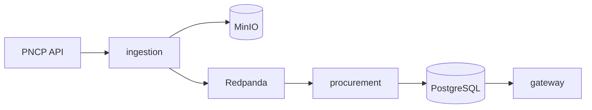

# Fase 1 — Dados reais (PNCP → Postgres → API)

Objetivo: o radar do app lista oportunidades vindas do **PNCP**, persistidas em `procurement.opportunities`, sem depender do seed `demo-1`.

## Pipeline



## Subir localmente

```bash
cd licitalens-backend
make phase1-up
```

Isso sobe Postgres, Redpanda, MinIO, `ingestion`, `procurement` e `gateway`, aplica migrations comerciais **sem** `005_demo_seed.sql` e aguarda a primeira sincronização.

Verificação manual:

```bash
make phase1-verify
```

App (outro terminal):

```bash
cd licitalens-mobile
bun run commercial:web
```

Cadastre-se no fluxo SaaS, complete o perfil comercial e abra **Radar / Licitações** — os itens devem ter `source` PNCP e links para `pncp.gov.br`.

## Variáveis úteis

| Variável | Padrão | Uso |
|----------|--------|-----|
| `SYNC_INTERVAL` | `5m` | Intervalo do loop de ingestão |
| `PNCP_RECENT_PAGES` | `3` | Páginas recentes por modalidade/dia |
| `PNCP_MODALITIES` | `6` | Modalidades PNCP (vírgula) |
| `PNCP_PAGE_SIZE` | `50` | Tamanho de página na API PNCP |

Exemplo de sync mais frequente:

```bash
SYNC_INTERVAL=2m PNCP_RECENT_PAGES=5 make phase1-up
```

## Stack comercial + dados reais

Para Mailpit, Keycloak e worker de alertas **com** pipeline PNCP:

```bash
SKIP_DEMO_SEED=1 make commercial-up
docker compose -f compose.yaml -f compose.commercial.yaml up -d --build redpanda minio ingestion procurement
make phase1-verify
```

## Diagnóstico

```bash
docker compose -f compose.yaml -f compose.commercial.yaml logs -f ingestion procurement
```

- **Ingestão sem Kafka/S3:** o serviço `ingestion` exige `KAFKA_BROKERS` e `S3_ENDPOINT` (já definidos no `compose.yaml`).
- **`make sync` (CLI):** grava em `.data/raw` e imprime eventos no stdout — **não** alimenta o Postgres; use o serviço `ingestion` ou evolua o CLI depois.
- **Runbook operacional:** [`runbook.md`](runbook.md).

## Critério de fechamento da fase 1

- `make phase1-verify` passa (≥1 linha `source=pncp` no banco e na API).
- App `commercial:web` mostra licitações reais após perfil configurado.

Próximo passo de produto: **Fase 2** em [`PRODUCT-ROADMAP.md`](PRODUCT-ROADMAP.md) (`DEMO_MODE=false`, Stripe, SMTP, domínio).
