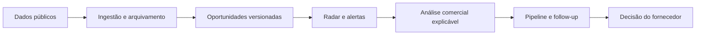

# LicitaLens — propósito e caminho até o lançamento

## Propósito final

O LicitaLens é uma plataforma privada de inteligência comercial para fornecedores que querem descobrir, priorizar e organizar oportunidades de compras públicas.

O produto:

- coleta dados públicos do PNCP e de fontes integradas;
- cruza oportunidades com o perfil comercial da empresa;
- explica os fatores de aderência com evidências;
- organiza o trabalho em radar, alertas, pipeline e follow-ups;
- acompanha assinatura, consumo e operação da organização.

O produto **não** é o portal oficial de contratações, não envia propostas, não habilita empresas, não julga licitantes e não substitui o edital ou assessoria jurídica/contábil.

## Caminho do produto

Cada etapa deve preservar a fonte, o horário de atualização e a organização responsável pela ação. A decisão final é sempre do usuário.

## Critérios para fechar a versão comercial

### 1. Autenticação e segurança

- OIDC/Keycloak obrigatório fora do modo demo.
- JWT validado no gateway e associação do usuário à organização verificada no banco.
- Nenhum endpoint privado aceita apenas headers de identidade enviados pelo cliente.
- `ADMIN_API_KEY` obrigatório e separado para operações administrativas.
- CORS restrito a origens explícitas em `ALLOWED_ORIGINS`.
- Segredos somente por secret manager/variáveis protegidas; nunca no repositório.
- Isolamento entre organizações coberto por testes e logs com `request_id`.
- Rate limit, rotação de chaves, backup criptografado e procedimento de incidente.

O gateway agora falha na inicialização quando `DEMO_MODE=false` e faltam configurações críticas, e não cai silenciosamente para armazenamento em memória se o PostgreSQL estiver indisponível.

### 2. Infraestrutura definitiva

- PostgreSQL para estado transacional e tenancy.
- Storage S3 compatível para payloads brutos e replay.
- Redpanda/Kafka para eventos versionados entre ingestão, procurement, IA e notificações.
- pgvector para representações semânticas.
- ClickHouse somente quando o dashboard analítico persistido estiver ativo; até lá, não tratar gráficos locais como analytics de produção.
- Worker de notificações com SMTP e Expo configurados, deduplicação e monitoramento.
- Kubernetes/Helm com ingress HTTPS, readiness real, recursos, autoscaling e logs centralizados.
- Gateway expõe `/metrics` em formato Prometheus com contagem e latência acumulada de requisições; a coleta e os alertas ainda devem ser ligados no ambiente de produção.
- Backups, restore testado e retenção definida.

### 3. Assinaturas, cobrança e gestão interna

- Stripe em modo produção com preços Essential e Pro configurados.
- Checkout vinculado à organização por `client_reference_id` e metadata.
- Webhook validado por assinatura, idempotente e protegido contra eventos fora de ordem.
- Portal do cliente para cartão, faturas, cancelamento e atualização de assinatura.
- Entitlements aplicados no gateway, nunca por headers informados pelo cliente.
- Estados tratados: `trialing`, `active`, `past_due` e `canceled`.
- Histórico de assinatura persistido para suporte e auditoria.
- Painel interno para consultar organizações, plano atual, histórico e executar ciclo de notificações.
- Runbook para falha de webhook, inadimplência, reprocessamento e atendimento.

### 4. Produto e conformidade

- Aviso de que score é indicador comercial, não habilitação ou julgamento.
- Selo visível para dados de demonstração.
- Fonte, edital, anexos e data de atualização acessíveis no detalhe.
- Termos de Uso, Política de Privacidade e revisão LGPD antes do lançamento.
- Revisão jurídica formal do posicionamento comercial.

## Definition of Done

A versão comercial só deve ser considerada fechada quando os quatro blocos acima estiverem validados em ambiente semelhante à produção, com smoke tests web e celular, cobrança em modo de teste, webhook replayado, isolamento multiempresa verificado e backup restaurado com sucesso.

### Entregas no repositório (referência)

| Fase | Comando / doc |
|------|----------------|
| 1 — Dados PNCP | `make phase1-up` · [`FASE-1-DADOS-REAIS.md`](FASE-1-DADOS-REAIS.md) |
| 3 — Infra | `make phase3-up` · [`FASE-3-INFRA.md`](FASE-3-INFRA.md) |
| 4 — Conformidade (app + checklist) | [`FASE-4-CONFORMIDADE.md`](FASE-4-CONFORMIDADE.md) |
| 2 — Cobrança/auth produção | `DEMO_MODE=false` + `.env.prod.example` (pendente validação em domínio real) |
