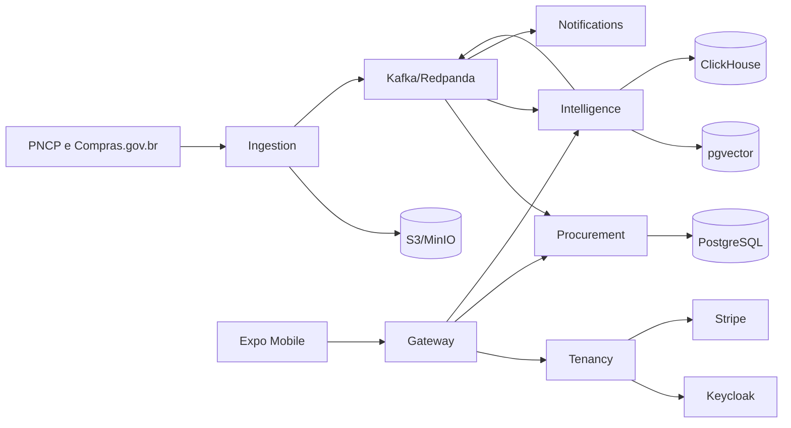

# Arquitetura

O LicitaLens mantém serviços implantáveis separadamente e comunicação assíncrona para o pipeline de dados.

## Decisões

- O payload original é arquivado antes da emissão do evento, permitindo auditoria e replay.
- Eventos têm nome e versão explícitos. Alterações incompatíveis criam uma nova versão.
- PostgreSQL contém estado transacional, ClickHouse o read model analítico e `pgvector` os vetores.
- Score e filtros são determinísticos. O LLM recebe somente evidências calculadas e pode falhar sem indisponibilizar a busca.
- Em desenvolvimento, o gateway mantém uma vertical slice em memória. Os binários dos demais serviços e seus bancos delimitam a extração para adaptadores persistentes.

